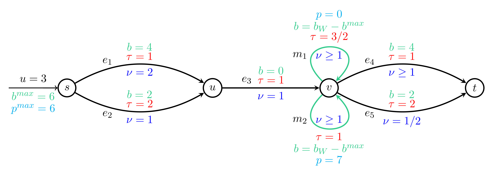

# Capacitated Equilibrium for Dynamic Traffic Assignment
This code computes an approximate `dynamic capacitated equilibrium` for multicommodity networks with resource
constrained paths between given source-destination pairs. A fixed-point algorithm is implemented that
starts from a feasible path-based flow and iteratively converges to an approximate dynamic equilibrium by discretizing
the continuous time-scale.

# Installation (Linux)
* Install Python 3.8 (if not already available) using `sudo apt install python3.8`
* Install the networkx package using `pip3 install networkx`

# Preparing Input Files
* Network

The code reads the network using a row-wise description of its edges in a space-separated format as follows:

`nodeFrom nodeTo edgeCapacity edgeTravelTime edgeResourceConsumption edgePrice`

* Commodities

Different commodities are described as rows of a simple space-separated text file in the following format:

`nodeFrom nodeTo resourceBudget priceBudget time0 time1 time2 ... flowValue0_1 flowValue1_2 ...`

The input flow is assumed to be piecewise constant and is described using the time-breakpoints `time0 time1 ...`
and the values of the inflow between consecutive breakpoints (for example, `flowValue0_1` indicates the inflow
in the time interval `[time0, time1)`.

# Running the Code
The code can be run using the script `main.py` with parameters passed as space separated arguments as follows:

`python3 main.py <networkFile> <commodityFile> <instanceName> <timeHorizon> <iterationLimit> <timeLimit> <precision> <alpha0> <timeStep> <priceToTime> <numThreads>`

# A Toy Example

Consider the following network.

The networkFile for reading this network is [evExample6EdgesWR.txt](examples/toyExamples/evExample6EdgesWR.txt) and an example of a commodityFile for this network is <a href="examples/toyExamples/evExample6Comm.txt" target="_blank"> evExample6Comm.txt</a>.

